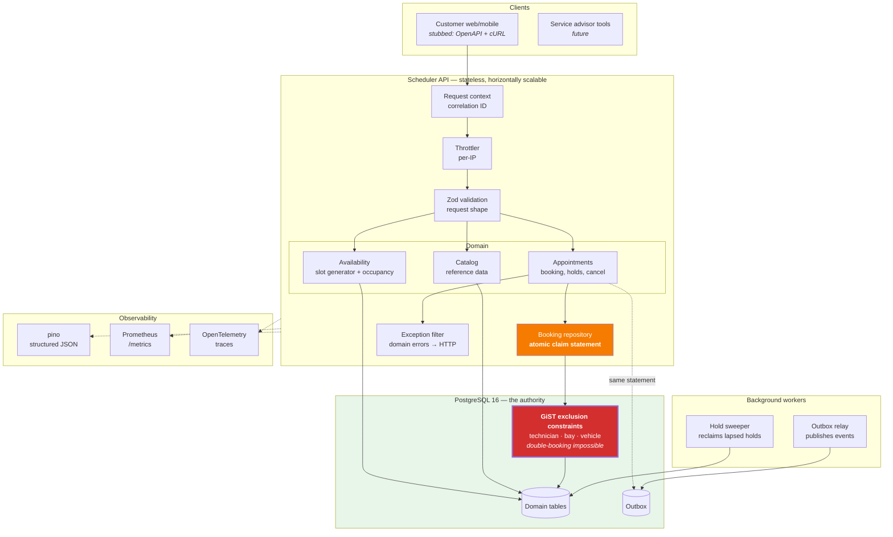
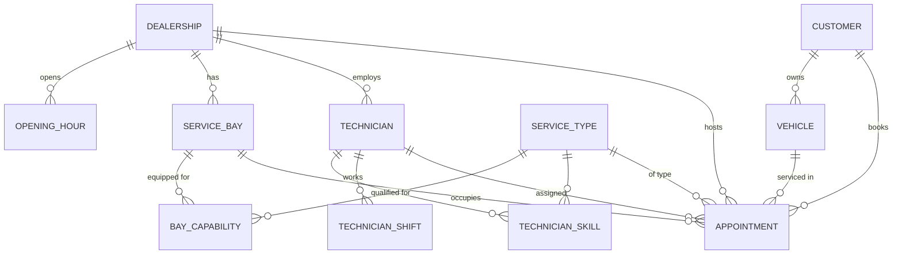
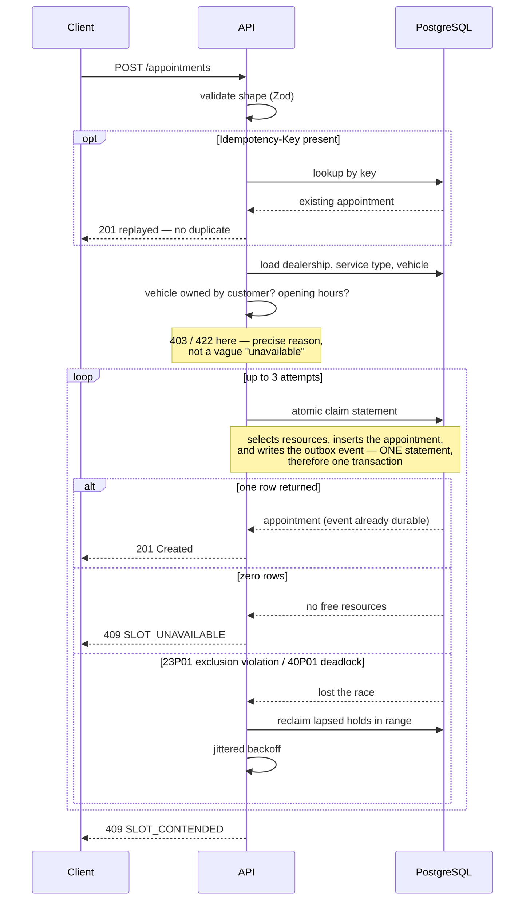
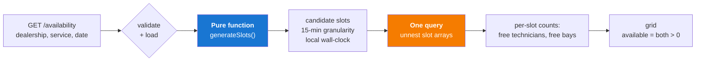

# System Design — Unified Service Scheduler

**Scenario A — Ownership.** An appointment scheduler replacing a dealership's
manual service booking.

---

## 1. The problem worth solving

The brief lists three requirements. The first and third are straightforward CRUD:

- **Requirement 1 — Resource-Constrained Booking.** Request an appointment for a
  vehicle, service type, dealership, and time.
- **Requirement 3 — Confirmed Appointment Record.** Persist a record associating
  customer, vehicle, technician, and bay.

Requirement 2 is not:

> **2. Real-Time Availability Check** — _before confirming_, check the
> availability of both a ServiceBay and a qualified Technician _for the entire
> service duration_.

"Check, then confirm" is a textbook check-then-act race. Two requests both read
"Ramp A is free at 09:00", both pass their check, and both insert. The
dealership now has two cars booked into one bay and finds out on the day.

The manual system being replaced had a human as the lock — one person with one
diary, physically unable to write two bookings in the same box. Replacing that
human means reproducing the guarantee, not just the workflow.

**Everything in this design follows from that.** The goal is to make an
overlapping booking _structurally impossible_ rather than merely unlikely —
while staying concurrent, because a lock that serialises correctly but throttles
throughput has only moved the failure somewhere harder to see.

Secondary requirement, from _Build For the Future_: scalability, performance,
reliability, maintainability, observability. These shape the design as much as
the three functional requirements — noted inline where they do.

---

## 2. Architecture



The red box is where correctness lives. Everything above it is an optimisation
that makes the common case fast; none of it is trusted to be sufficient.

### Component roles

| Component                      | Role                                                                 | Why it exists                                                                                                                                                             |
| ------------------------------ | -------------------------------------------------------------------- | ------------------------------------------------------------------------------------------------------------------------------------------------------------------------- |
| **Request context middleware** | Assigns a correlation ID per request, honours inbound `X-Request-Id` | A booking that retries emits several log lines; without a shared id they cannot be reassembled. Uses `AsyncLocalStorage` so domain code never carries a transport concern |
| **Throttler**                  | Per-IP rate limiting, two windows (burst + sustained)                | Cheap abuse protection. Per-IP rather than per-customer only because there is no auth — named as a limitation in §8                                                       |
| **Zod validation**             | Rejects malformed requests before any handler runs                   | One schema yields the runtime validator, the TypeScript type, _and_ the OpenAPI document, so the three cannot drift                                                       |
| **Availability**               | Generates candidate slots, marks each free or busy                   | Split in two: a **pure function** for slot shape, one query for occupancy. Advisory by design — never a reservation                                                       |
| **Booking repository**         | The atomic claim statement                                           | Selection and insertion in **one** statement, so there is no window between finding a free bay and taking it                                                              |
| **Appointments service**       | Domain rules, retry policy, idempotency                              | Holds no locks and opens no long transactions; mutual exclusion is delegated entirely to the database                                                                     |
| **Exception filter**           | Maps domain errors to HTTP status codes                              | A single exit point means no driver message or stack trace can escape into a response                                                                                     |
| **Hold sweeper**               | Deletes lapsed reservations                                          | Housekeeping, _not_ correctness — see §5. Uncoordinated across replicas by design: the delete is idempotent                                                               |
| **Outbox relay**               | Publishes confirmation events                                        | Keeps all network I/O off the booking path. Claims batches with `FOR UPDATE SKIP LOCKED`, so replicas partition work rather than duplicate it                             |
| **PostgreSQL**                 | Source of truth **and** the concurrency arbiter                      | The only component that sees both racing writes, so the only one that can adjudicate                                                                                      |

### Code organization

The service is a **modular monolith**, not a set of services. One database
transaction has to span the technician check, the bay check, and the insert; if
those lived in separate services that transaction becomes a distributed one,
and the guarantee this whole design rests on becomes a saga with compensations.
The modules are drawn where services _could_ later be split, but splitting them
now would trade the strongest property of the system for an organizational
benefit nobody currently needs.

```text
apps/api/src/
  modules/         appointments · availability · catalog · background-jobs
  common/          envelope, exception filter, request context, domain errors
  observability/   metrics, tracing, logging
  prisma/          client lifecycle
packages/contracts/  request schemas, response types, error codes
```

`modules/` holds features; the rest is plumbing every module depends on, left
flat rather than gathered under a `shared/` alias that would imply a boundary
that isn't there.

**One package is extracted, and only one.** The brief has the client stubbed
rather than built, which creates a real failure mode: a stub that restates the
request shape in its own words drifts from the server the moment either side
changes, and nothing catches it. `@scheduler/contracts` holds the Zod schemas,
the response envelope types, and the error-code union, so validation, the
TypeScript type, and the published OpenAPI document all derive from one
declaration. It exports plain Zod and depends only on `zod` — applying
`createZodDto` there would drag NestJS into anything a browser imports.

That prediction has since been tested rather than left as an assertion. A demo
client now lives at `apps/web` — a small Vite and React application that
consumes the package directly, importing its types and calling
`createHoldSchema.safeParse` on the booking form before submitting. Because the
browser and the server validate against the same declaration, the drift this
package exists to prevent cannot occur silently; a shape change breaks the
client's typecheck. The client resolves the package to its _source_ rather than
its build output, matching the precedent already set in
`apps/api/jest.config.js`, so a stale `dist` can never let types and runtime
disagree.

The client does not change the shape of the submission: the backend remains the
implemented layer, and the OpenAPI document and cURL walkthrough remain the
contract the brief asked for. What it adds is legibility. The concurrency
guarantee was previously only demonstrable through a shell loop and a `psql`
count; it can now be watched. The one place the client still restates a server
shape in its own words is the appointment record, which `@scheduler/contracts`
does not publish because it exists only as a Prisma inference — that is isolated
to a single file, so publishing an `AppointmentView` later is a deletion rather
than a refactor.

Adding it required exactly one endpoint, `GET /customers`. Seed identifiers are
`gen_random_uuid()`, so without it the only way to discover a customer was the
seed script's stdout — acceptable for a cURL walkthrough, not for a picker.

Prisma, the domain error classes, and the slot generator stay inside the API.
Each has exactly one consumer; extracting them would add import boundaries
without adding seams, which is structure that signals rigour without doing any.

Turborepo is honest about its size here: with two packages its task graph saves
little wall-clock time. It earns its place by making build order explicit —
contracts must compile before the app that consumes it — and by keeping
database-backed tasks marked `"cache": false`, since their result depends on
live database state rather than on file inputs. A cached "pass" for a suite
that never ran against the current schema is worse than no cache at all.

---

## 3. Data model



Four decisions worth defending:

**`endAt` is stored, not derived.** Computed once from
`ServiceType.durationMinutes` at booking time. The constraint can then
range-check without a function call, and changing a service's duration later
never retroactively moves existing bookings.

**All instants are `timestamptz` (UTC).** `Dealership.timezone` (IANA) drives
slot generation and display only. Storing local time would make every
cross-timezone query wrong in a way that only shows up twice a year.

**Skills and capabilities are join tables, not enum arrays.** A technician is
qualified iff `technician_skill` has the row. Eligibility becomes a plain SQL
join that the same query can evaluate atomically — with an array column it would
be application-side filtering, which reintroduces the read-then-write gap.

**Status is `HELD | CONFIRMED | CANCELLED | COMPLETED`.** Cancelled rows are
retained for audit but excluded from conflict checks, so cancelling frees a slot
without destroying history.

---

## 4. Concurrency — the core of the design

### Layer 1: exclusion constraints (the actual guarantee)

```sql
CREATE EXTENSION IF NOT EXISTS btree_gist;

ALTER TABLE appointment ADD CONSTRAINT appointment_no_technician_overlap
  EXCLUDE USING gist (
    technician_id WITH =,
    tstzrange(start_at, end_at, '[)') WITH &&
  ) WHERE (status IN ('HELD','CONFIRMED'));
-- identical constraints on service_bay_id and vehicle_id
```

Prisma's schema language cannot express these, so they live in hand-written
migration SQL. Three details carry weight:

- **`'[)'` half-open bounds.** A job ending at 10:00 and one starting at 10:00
  do not overlap, so back-to-back scheduling works. With `'[]'` every
  appointment would sterilise the slot after it.
- **`HELD` participates**, so a reservation genuinely blocks competitors.
- **The vehicle constraint** stops one car being booked into two bays at once —
  something the other two constraints would happily permit.

An overlapping row is now impossible to write, regardless of application bugs,
retry logic, or how many API instances are running.

### Layer 2: the atomic claim statement

**Rejected: `SELECT … FOR UPDATE` on the technician and bay rows.** This was the
first design, and it is wrong in an instructive way. A row lock locks the
_resource_, not the _time slot_ — booking a technician at 09:00 blocks an
unrelated 15:00 booking for the same technician. At a busy dealership that
degenerates into a hot-row queue: correct, and serialised. Exclusion constraints
conflict only on `(resource, overlapping range)`, the finest granularity
available, so unrelated bookings never interact. The constraints therefore
_replace_ pessimistic locking rather than backing it up.

Selection and insertion happen in one statement:

```sql
WITH free_technician AS (
  SELECT t.id FROM technician t
  WHERE t.dealership_id = $1 AND t.active
    AND EXISTS (SELECT 1 FROM technician_skill …)      -- qualified
    AND EXISTS (SELECT 1 FROM technician_shift …)      -- on shift for the WHOLE service
    AND NOT EXISTS (                                    -- not already committed
      SELECT 1 FROM appointment a
      WHERE a.technician_id = t.id
        AND a.status IN ('HELD','CONFIRMED')
        AND (a.status = 'CONFIRMED' OR a.hold_expires_at > now())
        AND tstzrange(a.start_at, a.end_at, '[)') && tstzrange($start, $end, '[)'))
  ORDER BY random() LIMIT 1
),
free_bay AS ( /* same shape: capability + availability */ )
INSERT INTO appointment (…)
SELECT … FROM free_technician, free_bay
RETURNING *;
```

The cross join yields exactly one row when both CTEs found a resource and zero
rows when either did not — so "nothing available" costs no extra query. The
`NOT EXISTS` probes ride the GiST indexes the constraints already create, so no
additional index is needed.

**`ORDER BY random()` is deliberate.** `ORDER BY least_loaded` is the obvious
choice and is actively harmful: every concurrent request computes the same
least-loaded technician and targets it, so N−1 collide. The fairness heuristic
manufactures the contention it appears to relieve. Randomising across the free
pool drops the conflict rate from roughly O(N) toward zero.

### Layer 3: bounded retry and fail-fast

- Catch SQLSTATE `23P01`, retry, **max 3 attempts**, jittered backoff, then
  `409`. Unbounded retry under a stampede converts a contended slot into
  sustained database load.
- `lock_timeout = 2s`, `statement_timeout = 5s` — requests fail fast rather than
  queueing and exhausting the connection pool. Under load, queueing is how one
  hot slot becomes a service-wide outage.
- Isolation stays `READ COMMITTED`. `SERIALIZABLE` would add `40001` retries for
  no benefit, because the constraint is the authority, not the snapshot.

### Booking flow



Two distinct 409s, deliberately. `SLOT_UNAVAILABLE` means genuinely full —
retrying is pointless. `SLOT_CONTENDED` means the system is under real
contention. Collapsing them would erase the only signal that distinguishes
"busy dealership" from "system fighting itself".

---

## 5. Reservation holds

Under contention, users lose slots between choosing and submitting. `POST /holds`
inserts a `HELD` row with a 2-minute TTL; `POST /appointments` promotes it **in
place** — the same row id, so the slot is never momentarily released.

**A subtle constraint interaction, worth stating because it caused a real bug.**
A PostgreSQL exclusion predicate must be `IMMUTABLE`, so it cannot call `now()`.
The predicate is `status IN ('HELD','CONFIRMED')` and nothing more. An _expired_
hold therefore still occupies the slot at the constraint level while appearing
free to every query — the slot advertises itself as bookable and rejects every
booking.

Two mitigations, layered:

- The **booking path reclaims** lapsed holds overlapping the requested window on
  conflict, before retrying. Self-healing, and it runs only after a conflict so
  the common path stays a single statement.
- The **sweeper** deletes expired holds every 30s. This is housekeeping, not
  correctness: it keeps the constraints' partial indexes small. Availability and
  booking both treat an expired hold as free regardless of when it last ran.

That separation is deliberate — _correctness that depends on a background job
running on time is correctness that fails when the job is late._

---

## 6. Data flow: availability



**Why the split.** Slot _shape_ depends only on the dealership calendar — no
database, no clock. That makes the awkward cases (DST transitions, services
overrunning closing time, foreign timezones) unit-testable in milliseconds
rather than reachable only through an integrated stack. Occupancy is the only
part that must touch the database.

**No N+1.** A day at 15-minute granularity is ~40 slots. Querying per slot would
be 80 round trips for one page load; instead the slots are passed as arrays and
`unnest`-ed server-side, for one round trip regardless of grid size.

**Timezone logic lives in exactly one place.** The generator attaches local
weekday and minute-of-day to each slot, and both availability and booking consume
those. An earlier version recomputed them in SQL with `AT TIME ZONE`, which
worked but meant two implementations that could disagree near midnight in some
zones.

**A wall-clock/elapsed-time distinction that DST tests caught.** Opening hours
are wall-clock times ("we close at 18:00 local"), so open and close resolve as
wall-clock instants. Slot _stepping_ is elapsed time, because an appointment
occupies real duration — a 60-minute service is 60 real minutes even if the
clock jumps during it. Treating opening hours as elapsed minutes from midnight
passed every ordinary test and would have opened the dealership an hour late
every spring.

---

## 7. Technology choices

| Choice                         | Why                                                                                                                                      | Alternatives considered                                                                                                                                                                                      |
| ------------------------------ | ---------------------------------------------------------------------------------------------------------------------------------------- | ------------------------------------------------------------------------------------------------------------------------------------------------------------------------------------------------------------ |
| **PostgreSQL 16**              | GiST exclusion constraints are the entire correctness story. This is not a preference — it is the requirement that selected the database | MySQL has no equivalent; the check would move into application code, back to check-then-act. MongoDB cannot express cross-document range exclusion at all                                                    |
| **`btree_gist` + `tstzrange`** | Native range overlap with index support. `&&` on a GiST index is what makes conflict detection both correct and fast                     | Manual `start < other_end AND end > other_start` in application code — same logic, none of the atomicity                                                                                                     |
| **NestJS 11**                  | DI makes the layering enforceable rather than aspirational; interceptors and filters give one place for the envelope and one for errors  | Express alone: less ceremony, but cross-cutting concerns end up duplicated per route. Fastify: faster, but the bottleneck here is the database, not the HTTP layer                                           |
| **Prisma 6**                   | Type-safe reads and migrations, with `$queryRaw` for the SQL that matters                                                                | Raw `pg`: full control, no type safety. TypeORM: weaker types. **Trade-off accepted:** the critical statement is hand-written SQL anyway, so the ORM earns its place on the 80% of queries that are ordinary |
| **Zod + nestjs-zod**           | One schema → validator, type, and OpenAPI document                                                                                       | `class-validator`: the Nest default, but the OpenAPI document is then maintained separately and drifts                                                                                                       |
| **Luxon**                      | Correct IANA timezone and DST arithmetic                                                                                                 | `date-fns-tz` is lighter; Luxon's zone-aware `DateTime` made the wall-clock/elapsed distinction explicit rather than incidental                                                                              |
| **pino**                       | Structured JSON, low overhead, correlation IDs                                                                                           | Winston: more features, measurably slower per line                                                                                                                                                           |
| **prom-client**                | Prometheus is the de-facto scrape standard                                                                                               | StatsD: push-based, needs extra infrastructure                                                                                                                                                               |
| **Jest + supertest**           | Integration tests exercise the real stack against real PostgreSQL                                                                        | Mocked repositories would prove only that the mocks return what they were told                                                                                                                               |

**On testing against a real database:** the behaviour under test here is
_emergent_ — SQL semantics, constraint enforcement, retry under contention. A
mocked repository cannot exhibit an exclusion violation, so a mock-based suite
would pass identically against a completely broken design. Testcontainers was
the original plan; the Docker daemon was unavailable when the suite was written,
so it targets a dedicated `scheduler_test` database instead. That remains the
arrangement: the test suite talks to a local PostgreSQL, while
`docker-compose.yml` runs the application stack — API plus PostgreSQL 16, with
migrations applied on container start and the database files bind-mounted into
the repository.

---

## 8. Observability

The generic RED signals come from HTTP instrumentation and say little about
_this_ system. Three metrics are specific to a contention-based design, and they
exist to answer one operational question: **is the dealership genuinely full, or
is the system fighting itself?**

| Signal                            | What it tells you                                         | Why it matters here                                                                               |
| --------------------------------- | --------------------------------------------------------- | ------------------------------------------------------------------------------------------------- |
| `booking_conflicts_total`         | Writes refused by an exclusion constraint                 | Rising = the resource pool is too small for demand, or candidate selection has started clustering |
| `booking_retry_exhausted_total`   | Requests that lost every attempt                          | These are customers who saw a failure. **This is the number that maps to harm**                   |
| `booking_attempts_per_request`    | Histogram, bucketed at the retry limit                    | The **leading** indicator — it climbs before anything is user-visible, so it is what to alert on  |
| `booking_attempts_total{outcome}` | confirmed / unavailable / contended / replayed / rejected | Separates "fully booked" from "contended" without reading logs                                    |
| `holds_active`                    | Live reservations                                         | Sustained growth means holds are being abandoned rather than completed — a UX signal              |
| `nodejs_eventloop_lag_*`          | Process saturation                                        | How connection-pool exhaustion actually presents                                                  |

**Logging** — pino, structured JSON, correlation ID per request via
`AsyncLocalStorage`, propagated to every line and returned as `X-Request-Id`.
Inbound ids are honoured so a trace begun at the edge stays continuous.
`Authorization`, `Cookie`, and `Idempotency-Key` are redacted. Health and
metrics scrapes are excluded from access logging — high frequency, no
diagnostic value.

**Tracing** — OpenTelemetry, initialised before any instrumented module is
imported. That ordering is load-bearing: auto-instrumentation works by patching
`http` and `pg` at require time, and patching afterwards silently produces no
spans, which is indistinguishable from tracing being off.

Auto-instrumentation alone is not enough here. It yields one `pg` span per
query, which shows that a request touched the database several times but not
why — a retry storm and a slow query look alike. Two manual spans supply the
missing structure:

| Span | Meaning | Attributes |
| --- | --- | --- |
| `booking.book` / `booking.hold` | one request | `booking.dealership_id`, `booking.service_type_id`, `booking.start_at`, `booking.outcome`, `booking.attempts` |
| `booking.attempt` | one claim on the slot | `booking.attempt_number`, `booking.max_attempts` |

A contended booking is then legible as what it is: one `booking.book` span
containing several `booking.attempt` children, the losers carrying a recorded
`23P01` exception, with a `booking.race_lost` event marking each on the parent's
timeline. `booking.outcome` uses the same vocabulary as the metrics
(`confirmed · replayed · unavailable · contended · rejected`), so a suspicious
counter and the traces behind it are read together rather than reconciled by
guesswork. No customer, vehicle, or appointment id becomes a span attribute —
those identify a person, and a trace backend is the component that retains
longest and secures least.

Health probes and metric scrapes are excluded from traces, filtered against the
same `probe-paths.ts` list that excludes them from access logs, so an endpoint
cannot end up quiet in one and noisy in the other.

**Logs and traces join in both directions.** `instrumentation-pino` injects
`trace_id` and `span_id` into every log record, which gets you from a log line
to its trace; the request id minted in `genReqId` is set on the active span as
`app.request_id`, which gets you back.

Inert unless `OTEL_EXPORTER_OTLP_ENDPOINT` is set — exporting to nowhere adds
latency and noisy connection errors in development and CI. `docker compose
--profile observability` starts Jaeger to export to, so the claims above are
demonstrable rather than asserted. Its spans persist to `./.data/jaeger` on
Badger with the default 72-hour retention, rather than the image's default
ephemeral storage: a trace store that forgets everything on restart cannot
answer the question it exists to answer.

**Health** — `/health` (liveness, touches nothing) is separate from
`/health/ready` (readiness, pings the database) so a database blip removes the
instance from the load balancer without triggering a restart loop that would
make the outage worse.

### Known gaps, stated plainly

- **No authentication.** The brief does not ask for it, and adding a login
  system would spend effort outside the graded requirements. But the one
  ownership rule the domain _implies_ is enforced: an appointment associates a
  customer and _their_ vehicle, so `VehicleNotOwnedError` is checked server-side,
  and `HoldNotOwnedError` stops one customer confirming another's reservation.
  Both read the customer id from the request body — the one seam a real guard
  would replace, by resolving it from a verified token instead.
  Consequence: the API is IDOR-able, and rate limiting is per-IP rather than
  per-customer, so one abusive client behind a shared NAT consumes the budget
  for everyone behind it.
- **Availability is uncached.** Correct but unnecessarily expensive at scale —
  see §9.
- **The outbox relay is at-least-once.** Consumers must be idempotent;
  `aggregateId` + `eventType` is the natural deduplication key. Duplicates come
  from genuine retries only — not from the number of replicas running, which is
  what an uncoordinated poll would have caused.
- **Event ordering is rough FIFO, not global.** Relays claim disjoint batches
  and finish independently, so a consumer needing per-aggregate ordering must
  impose it itself. Ordering was never promised, but a single-replica relay
  would have appeared to provide it.

---

## 9. Scaling — documented, not built

The current design is correct and horizontally scalable as-is: the API is
stateless, so all coordination lives in PostgreSQL. That holds for the two
background jobs as well, which is worth stating because it is where a stateless
API most often stops being one — every replica runs both crons. The relay claims
its batch with `FOR UPDATE SKIP LOCKED`, so concurrent relays take disjoint rows
and throughput rises with replica count instead of being serialised behind an
elected leader; a relay that dies mid-batch rolls back and its rows become
immediately visible to the others, so there is no lease to expire and no
stuck-row reaper to run. The sweeper needs no coordination at all: its delete is
idempotent, so concurrent sweeps cost a redundant query and nothing else. These
are the next steps, in the order the load would demand them.

**Read/write asymmetry is the defining characteristic.** Availability reads
outnumber bookings by roughly 100:1 — every customer browses, few book. Scale
the two paths separately.

| Step | Change                                                            | Why, and what it costs                                                                                                                                                                                                     |
| ---- | ----------------------------------------------------------------- | -------------------------------------------------------------------------------------------------------------------------------------------------------------------------------------------------------------------------- |
| 1    | **Cache availability** in Redis, 15–30s TTL, invalidated on write | Absorbs the dominant read load. The cache is a _hint that filters_ — booking always re-validates against PostgreSQL, so a stale cache can waste a request but never overbook                                               |
| 2    | **Read replicas** for `GET /availability`                         | Removes read load from the primary. Replication lag is acceptable precisely because availability is already advisory                                                                                                       |
| 3    | **PgBouncer**, transaction mode                                   | Connection multiplexing. **Real constraint:** Prisma requires `?pgbouncer=true`, which disables prepared statements and costs some planning time per query. Worth naming because it is a genuine trade-off, not a free win |
| 4    | **Range-partition `appointment` by `start_at`**, monthly          | Keeps the GiST indexes small and resident. Old partitions detach rather than delete. The overlap probes every booking depends on degrade as those indexes grow                                                             |
| 5    | **Per-customer rate limiting**                                    | Requires authentication first — see §8                                                                                                                                                                                     |

**What does _not_ need to change:** the concurrency design. Exclusion
constraints work identically across any number of API instances, because the
arbiter is the database. Adding capacity does not weaken the guarantee, which is
the property that made this approach worth choosing over application-level
locking.

**The real ceiling** is single-primary write throughput. Beyond it, shard by
dealership — a natural boundary, since no appointment spans two dealerships and
no query joins across them.

---

## 10. How GenAI was used in the design phase

The brief asks for this specifically. `README.md` §AI Collaboration Narrative
covers the implementation phase; `docs/ai-collaboration-log.md` is the raw,
unedited record. This section covers **design**.

**Strategy: use the model to generate candidates fast, then attack them.** The
value was never in the first answer — it was in having something concrete and
specific enough to be _wrong in an identifiable way_. Three examples where that
mattered:

**The rejected locking design.** The first proposal was
`SELECT … FOR UPDATE` on technician and bay rows, with a constraint as backstop.
It is textbook, it is what most engineers would write, and it would have
shipped. What caught it was asking a mechanical question rather than a stylistic
one: _what does this lock actually lock?_ It locks the technician row, so a
09:00 booking blocks an unrelated 15:00 booking. That reframed the constraint
from backstop to authority and removed pessimistic locking entirely.

**Scope discipline.** An early pass added JWT auth, login, and roles. Re-reading
the brief showed "Domain: Ownership" names the business domain — vehicle
ownership, the post-sale product area — not an access-control requirement. The
model had pattern-matched "production API" and supplied the usual furniture.
Cut to the single ownership rule the domain actually implies, with a documented
seam.

**A counterintuitive correction.** `ORDER BY least_loaded` looks obviously
right. Reasoning explicitly about what N simultaneous requests each compute
showed it manufactures contention. `ORDER BY random()` looks wrong and is
correct — and is commented as such, because a future reader will otherwise
"fix" it.

**Verification, not review.** Three findings came from execution rather than
inspection, and none would have survived a reading-based review:

- The **DST bug** — opening hours treated as elapsed rather than wall-clock
  time. Correct 363 days a year; no reviewer would flag the line.
- The **expired-hold constraint gap** — an exclusion predicate cannot call
  `now()`, so a lapsed hold blocks at the constraint level while appearing free
  to every query. Surfaced as an _intermittent_ test failure, which is normally
  dismissed as flakiness.
- The **vacuous-test check** — the concurrency suite went green on the first
  run, which is exactly when a test deserves the most suspicion. An independent
  measurement disagreed; chasing down which one lied confirmed the result and
  produced a genuine insight about how the two layers divide the work.

**The honest summary:** the model was most useful for breadth — generating the
schema, the SQL skeleton, the test scaffolding, and the plausible-but-wrong
first design that was worth arguing with. It was least reliable exactly where
correctness mattered most: concurrency semantics, timezone arithmetic, and
third-party library behaviour. Every claim in this document that matters is
backed by something that was run, not something that was asserted.

---

## 11. Verification

| Layer                     | Count | What it proves                                                                                                                         |
| ------------------------- | ----- | -------------------------------------------------------------------------------------------------------------------------------------- |
| **Unit** (no database)    | 23    | Slot generation across DST transitions, closed days, closing-time overrun, foreign timezones, input validation, configuration parsing  |
| **Constraint proof**      | 12    | The database rejects overlaps — asserted _before_ any service code existed, so nothing downstream trusts an unverified guarantee       |
| **Booking rules**         | 21    | Booking, refusals with precise codes, holds, hold ownership, idempotency, cancellation, reads                                          |
| **Availability**          | 10    | Occupancy reflects qualification, capability, shift coverage, and existing bookings                                                    |
| **Catalog, health, jobs** | 15    | Reference data, probes, metrics format, hold sweeper, and outbox atomicity — a forced outbox failure must roll the appointment back    |
| **Outbox relay**          | 5     | Concurrent relays dispatch each event exactly once — the test fails against an uncoordinated poll, which duplicates _and_ under-covers |
| **Concurrency**           | 5     | The decisive tests — see below                                                                                                         |

**Coverage: 94.7% statements, 96.0% lines, 97.4% functions** (107 tests).

The decisive test fires **200 simultaneous bookings at one slot backed by one
bay** and asserts exactly one `201`, 199 `409`, and exactly one row in the
table. A sequential test would prove nothing here — the naive check-then-act
implementation this design exists to avoid passes every sequential test ever
written and fails the moment two customers click at once.

Related cases: capacity 5 against 200 bookers fills every bay exactly once
(neither overbooking nor conceding early); technician scarcity limits correctly;
mixed hold/booking traffic still yields one winner; and concurrent requests
sharing an idempotency key produce one appointment.

Measured on the reference machine: 200 concurrent requests settle in **258 ms**,
with `booking_conflicts_total` at zero — the winner commits fast enough that
losers' availability filters already see the slot taken. The exclusion
constraint is the backstop for the genuinely simultaneous window, not the
everyday path.

```bash
cd apps/api
pnpm test              # unit
pnpm test:integration  # integration + concurrency, needs PostgreSQL
pnpm test:cov          # combined coverage
```

`docs/curl-walkthrough.md` reproduces the whole flow by hand, including a
50-request concurrency demo.
